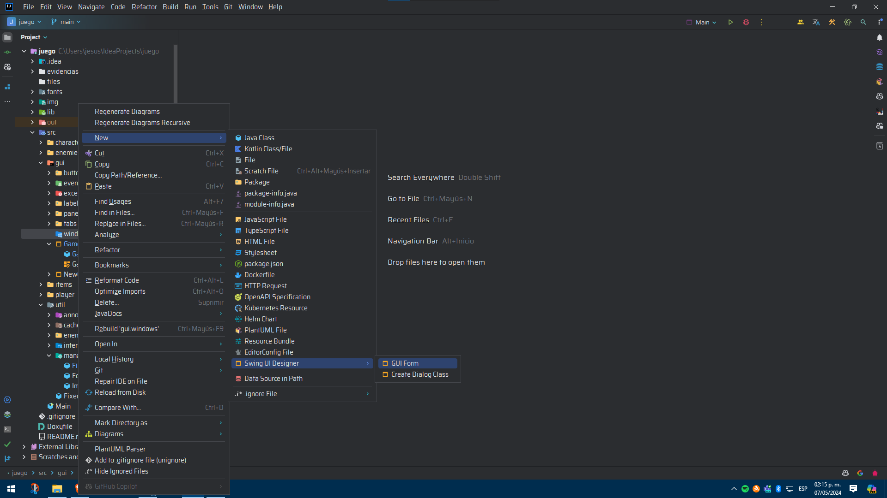
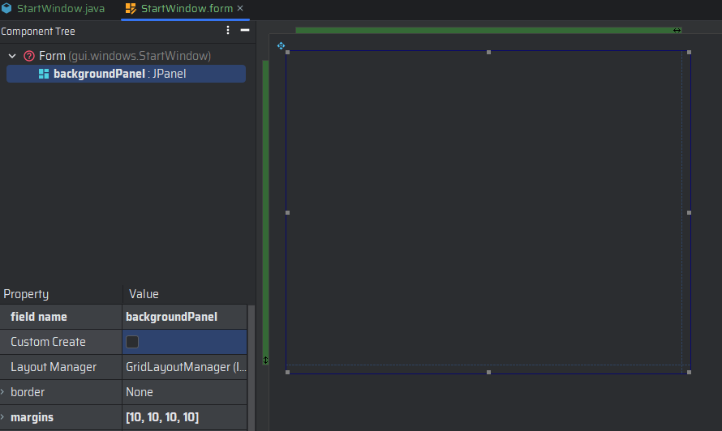
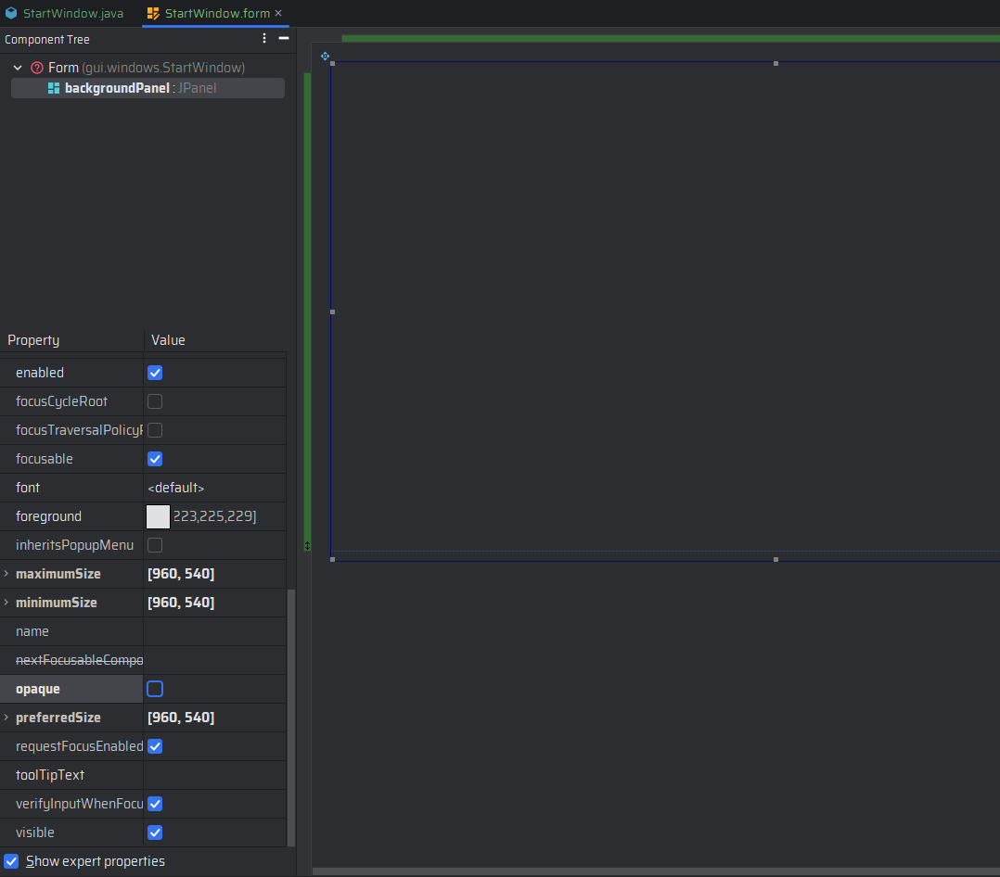
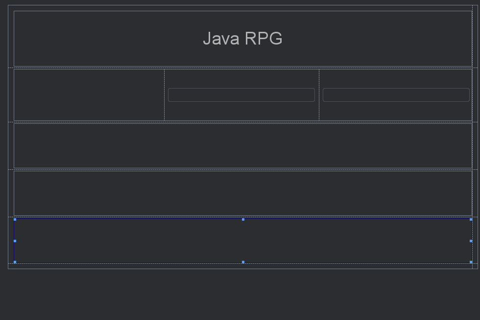
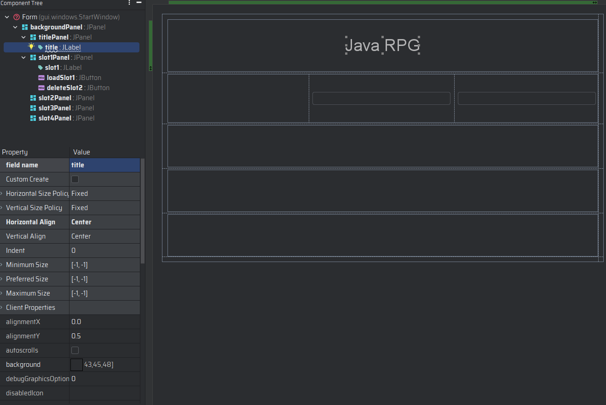
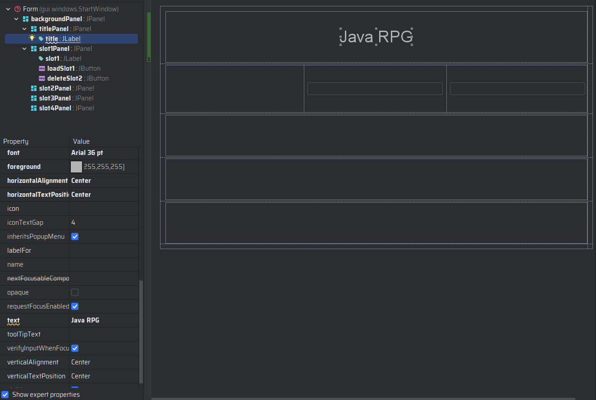
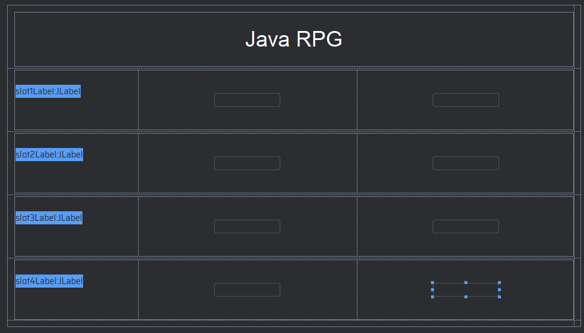
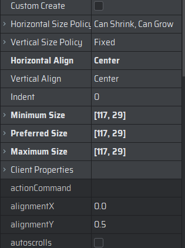
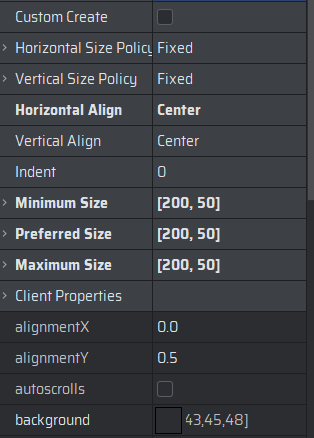
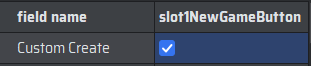

# El guardado de datos

En esta sección aprenderemos a guardar y cargar datos en nuestro programa. Para ello, utilizaremos la clase `File` de
Java, que nos permitirá leer y escribir archivos en el sistema de archivos del usuario, y modificaremos la
clase `FileManager` para que pueda guardar y cargar los datos de nuestro juego.

## Paso 1: Actualizar la clase `FileManager`

1. Abra IntelliJ IDEA y vaya a la clase `FileManager`.
2. Modifica los métodos de la clase para que ahora se vean de la siguiente manera:

    ```java
            public static Player loadGame(int slot) throws FileNotFoundException {
        
                Player player;
                try {
        
                    File file = new File(String.format("files/game%d.dat", slot));
                    player = (Player) new ObjectInputStream(new FileInputStream(file)).readObject();
                } catch (IOException | ClassNotFoundException e) {
                    throw new FileNotFoundException();
                }
                return player;
            }
        
            public static void saveGame(int slot) {
        
                ObjectOutputStream oos;
                try {
                    Player player = Player.getInstance();
                    File file = new File(String.format("files/game%d.dat", slot));
                    oos = new ObjectOutputStream(new FileOutputStream(file));
                    oos.writeObject(player);
                    try {
                        oos.close();
                    } catch (IOException e) {
                        JOptionPane.showMessageDialog(GameWindow.getInstance(player, slot),
                                "Error al guardar la partida", "Error", JOptionPane.ERROR_MESSAGE);
                    }
                } catch (IOException e) {
        
                    JOptionPane.showMessageDialog(GameWindow.getInstance(Player.getInstance(), slot),
                            "Error al guardar la partida", "Error", JOptionPane.ERROR_MESSAGE);
                }
            }
    ```

3. Modifica la clase `GameWindow` para que ahora se vea de la siguiente manera:

    ```java
        /**
         * Método que devuelve la instancia de la ventana principal
         *
         * @param player El jugador
         * @param slot   El slot de guardado
         *
         * @return La instancia de la ventana principal
         */
        public static synchronized GameWindow getInstance(Player player, int slot) {
    
            //Si la instancia es nula, la creamos
            if (instance == null) {
    
                instance = new GameWindow(player, slot);
            }
            //Devolvemos la instancia
            return instance;
        }
    
        /**
         * Constructor de la clase
         *
         * @param player El jugador
         * @param slot   El slot de guardado
         */
        private GameWindow(Player player, int slot) {
    
            this.player = player;
            this.slot = slot;
        }
   
        /**
         * Método que devuelve la instancia de la ventana principal
         *
         * @return La instancia de la ventana principal
         */
        public static synchronized GameWindow getInstance() {
    
            return instance;
        }
    ```

4. Modifica la clase `SaveButton` para que ahora se vea de la siguiente manera:

    ```java
    package gui.buttons;
    
    import gui.panels.DialogPanel;
    import util.managers.FileManager;
    
    public class SaveButton extends ActionButton {
    
        public SaveButton(int slot) {
    
            super("Guardar");
            // Asignar la acción de guardar el avance del jugador en el archivo correspondiente
            addActionListener(e -> {
                // Save the game
                FileManager.saveGame(slot);
                // Agregamos un texto al panel de diálogo para indicar que la partida se guardó correctamente
                DialogPanel.getInstance().addText("""
                        ------------------------------------------------
                        ¡Partida guardada correctamente!
                        ------------------------------------------------
                        """);
            });
        }
    }
    ```

5. Modifica la clase `BattlePanel` para que ahora se vea de la siguiente manera:

    ```java
        private void createUIComponents() {
    
            attackButton = new AttackButton(enemy);
            fleeButton = new FleeButton(enemy);
            saveButton = new SaveButton(GameWindow.getInstance().getSlot());
            exitButton = new ExitButton();
            skillsPanel = new SkillPanel();
        }
    ```

Con estos cambios, la clase `FileManager` ahora puede guardar, cargar y borrar partidas de nuestro juego.

## Paso 2: Creemos la ventana de inicio del juego y la ventana de carga de partida.

1. Usando el gestor de interfaces de IntelliJ IDEA, crea el panel llamado `StartPanel` en el paquete panels.
   
2. Dentro de la ventana `StartPanel`, modifica el nombre del panel inicial a `backgroundPanel` y agrega un margen de 10
   píxeles a cada lado.
   
3. Modifica las dimensiones de la ventana a 960x540 píxeles.
   
4. Agrega 5 paneles a la ventana `StartPanel` y modifica sus nombres a `titlePanel`, `slot1Panel`, `slot2Panel`,
   `slot3Panel` y `slot4Panel`.
   
5. Agrega una etiqueta en el panel `titlePanel` con el texto "Java RPG" y modifica su fuente a "Arial", tamaño 36 y
   negrita. Alinea la etiqueta al centro del panel. Modifica el color de la fuente a blanco.
   
   
6. Agrega una etiqueta y tres botones en cada panel de ranura (`slot1Panel`, `slot2Panel`, `slot3Panel` y
   `slot4Panel`). Modifica el texto de las etiquetas y botones a "".
   
7. Modifica las dimensiones de los botones a 117x29 píxeles. Y el alineamiento horizontal de los botones a "centro".
   
8. De igual manera, modifica las dimensiones de las etiquetas a 200x50 píxeles. Y el alineamiento horizontal de las
   etiquetas a "centro".
   
9. Modifica el nombre de cada etiqueta y botón de la siguiente manera:
    - `slot1Label`, `slot1NewGameButton` y `slot1LoadGameButton` para el panel `slot1Panel`.
    - `slot2Label`, `slot2NewGameButton` y `slot2LoadGameButton` para el panel `slot2Panel`.
    - `slot3Label`, `slot3NewGameButton` y `slot3LoadGameButton` para el panel `slot3Panel`.
    - `slot4Label`, `slot4NewGameButton` y `slot4LoadGameButton` para el panel `slot4Panel`.
10. En cada botón deberás marcar la opción de "Custom Create".
    

Con estos cambios, hemos creado la ventana de inicio del juego y la ventana de carga de partida.

## Paso 3: Creemos los botones de la ventana de inicio del juego.

1. Abra IntelliJ IDEA y crea las clases `NewGameButton` y `LoadGameButton` en el paquete `buttons`.
2. Haz que las clases `NewGameButton` y `LoadGameButton` hereden de `ActionButton`.
3. Modifica el constructor de cada clase para que ahora se vea de la siguiente manera:

    ```java
        public NewGameButton(int slot) {
            super("Nueva Partida");
        }
    ```

    ```java
        public LoadGameButton(int slot) {
            super("Cargar Partida");
        }
    ```
4. Agrega un atributo de la clase `int slot` a cada clase.
5. Crea una clase llamada `FileListener` en el paquete `events`.
6. Haz que la clase `FileListener` implemente la interfaz `ActionListener`.
7. Agrega un atributo de la clase `int slot` a la clase `FileListener`.
8. Agrega un atributo de la clase `ActionButton action` a la clase `FileListener`.
9. Agrega un constructor a la clase `FileListener` que reciba un `ActionButton action` y un `int slot`.
10. Modifica el constructor de cada clase para que ahora se vea de la siguiente manera:

    ```java
        public NewGameButton(int slot) {
            super("Nueva Partida");
            addActionListener(new FileListener(this, slot));
        }
    ```

    ```java
        public LoadGameButton(int slot) {
            super("Cargar Partida");
            addActionListener(new FileListener(this, slot));
        }
    ```

11. Modifica la clase `FileListener` para que ahora se vea de la siguiente manera:

    ```java
    package gui.events;
    
    import gui.windows.GameWindow;
    import gui.windows.NewGameWindow;
    import gui.buttons.ActionButton;
    import gui.buttons.LoadGameButton;
    import gui.buttons.NewGameButton;
    import gui.windows.StartWindow;
    import player.Player;
    import util.managers.FileManager;
    
    import javax.swing.*;
    import java.awt.event.ActionEvent;
    import java.awt.event.ActionListener;
    import java.io.FileNotFoundException;
    
    public class FileListener implements ActionListener {
    
        private final int slot;
        private final ActionButton button;
    
        public FileListener(ActionButton button, int slot) {
    
    
            this.slot = slot;
            this.button = button;
        }
    
        @Override
        public void actionPerformed(ActionEvent e) {
    
            // Este método se encarga de gestionar las acciones de los botones de la ventana de inicio
            switch (button) {
                case NewGameButton _ -> {
                    StartWindow.getInstance().dispose();
                    // Si el botón es de nueva partida, se abre la ventana de nueva partida
                    NewGameWindow.getInstance(slot).setVisible(true);
                }
                case LoadGameButton _ -> {
                    // Si el botón es de cargar partida, se carga la partida del slot correspondiente
                    try {
                        // Se carga la partida y se abre la ventana de juego
                        Player player = FileManager.loadGame(slot);
                        StartWindow.getInstance().dispose();
                        GameWindow.getInstance(player, slot).startGame();
                    } catch (FileNotFoundException fileNotFoundException) {
                        // Si no se encuentra la partida, se muestra un mensaje de error
                        JOptionPane.showMessageDialog(null, "No hay partida guardada en este slot",
                                "Error", JOptionPane.ERROR_MESSAGE);
                    }
                }
                default -> throw new IllegalStateException("Unexpected value: " + button);
            }
        }
    }
    ```

## Paso 4: Editemos la clase de la ventana de inicio del juego `StartPanel`.

1. Abra IntelliJ IDEA y vaya a la clase `StartPanel`.
2. Haz que la clase `StartPanel` herede de `BackgroundPanel`. La clase `BackgroundPanel` es una clase que hemos creado
   para poder agregar un fondo a los paneles de nuestra interfaz gráfica. Para ello, modifica la clase de la siguiente
   manera:

    ```java
   public class StartPanel extends BackgroundPanel {
    ```

3. Usaremos el patrón Singleton, por lo que debemos agregar un atributo estático de la clase `StartPanel` llamado
   `instance` y un método estático llamado `getInstance` que devuelva la instancia de la clase. Modifica la clase de la
   siguiente manera:

    ```java
    private static StartPanel instance;

    public static StartPanel getInstance() {
        if (instance == null) {
            instance = new StartPanel();
        }
        return instance;
    }
    ```

4. Agrega un constructor privado a la clase `StartPanel` para que no se pueda instanciar desde fuera de la clase.
5. Modifica el constructor de la clase para que ahora se vea de la siguiente manera:

    ```java
        private StartPanel() {
    
            super(ImageManager.getInstance().getImage("skillPanel"), new Dimension(960, 540));
            add(backgroundPanel);
            update();
        }
    
        public void update() {
    
            for (int i = 1; i <= 4; i++) {
                // Cargamos el nombre de la partida
                String slotName = "Slot " + i;
                JLabel slotLabel = null;
                try {
    
                    slotLabel = (JLabel) getClass().getDeclaredField("slot" + i + "Label").get(this);
                    Player player = FileManager.loadGame(i);
                    if (player != null)
                        slotName = player.getName();
                    slotLabel.setText(slotName);
                    slotLabel.setHorizontalAlignment(SwingConstants.CENTER);
                    slotLabel.setHorizontalTextPosition(SwingConstants.CENTER);
                    slotLabel.setForeground(Color.WHITE);
                    slotLabel.setFont(FontManager.getInstance().getFont("Standard"));
                    switch (i) {
                        case 1 -> {
                            slot1NewGameButton.setVisible(false);
                            slot1LoadGameButton.setVisible(true);
                        }
                        case 2 -> {
                            slot2NewGameButton.setVisible(false);
                            slot2LoadGameButton.setVisible(true);
                        }
                        case 3 -> {
                            slot3NewGameButton.setVisible(false);
                            slot3LoadGameButton.setVisible(true);
                        }
                        case 4 -> {
                            slot4NewGameButton.setVisible(false);
                            slot4LoadGameButton.setVisible(true);
                        }
                    }
                } catch (IllegalAccessException | NoSuchFieldException e) {
    
                    JOptionPane.showMessageDialog(null, "Error al cargar la partida " + i,
                            "Error", JOptionPane.ERROR_MESSAGE);
                } catch (FileNotFoundException e) {
    
                    slotLabel.setText("-- Vació --");
                    slotLabel.setHorizontalAlignment(SwingConstants.CENTER);
                    slotLabel.setHorizontalTextPosition(SwingConstants.CENTER);
                    slotLabel.setForeground(Color.RED);
                    slotLabel.setFont(FontManager.getInstance().getFont("Standard"));
                    switch (i) {
                        case 1 -> slot1LoadGameButton.setVisible(false);
                        case 2 -> slot2LoadGameButton.setVisible(false);
                        case 3 -> slot3LoadGameButton.setVisible(false);
                        case 4 -> slot4LoadGameButton.setVisible(false);
                    }
                }
            }
        }
    ```

6. Modifica la función `createUIComponents` para que ahora se vea de la siguiente manera:

    ```java
        private void createUIComponents() {
    
            // Creamos los botones de cargar partida
            slot1LoadGameButton = new LoadGameButton(1);
            slot2LoadGameButton = new LoadGameButton(2);
            slot3LoadGameButton = new LoadGameButton(3);
            slot4LoadGameButton = new LoadGameButton(4);
            // Creamos los botones de nueva partida
            slot1NewGameButton = new NewGameButton(1);
            slot2NewGameButton = new NewGameButton(2);
            slot3NewGameButton = new NewGameButton(3);
            slot4NewGameButton = new NewGameButton(4);
        }
    ```

7. Retira la opacidad a todos los paneles de la ventana `StartPanel`.
8. Modifica la clase `StartWindow` para que ahora se vea de la siguiente manera:

    ```java
    package gui.windows;
    
    import gui.panels.StartPanel;
    
    import javax.swing.*;
    
    public class StartWindow extends JFrame {
    
        private static StartWindow instance;
    
        public static StartWindow getInstance() {
    
            if (instance == null) {
                instance = new StartWindow();
            }
            return instance;
        }
    
        private StartWindow() {
    
            super("Start Window");
            add(StartPanel.getInstance());
            pack();
            setDefaultCloseOperation(JFrame.EXIT_ON_CLOSE);
            setLocationRelativeTo(null);
            setResizable(false);
            setVisible(true);
        }
    
        public void update() {
    
            StartPanel.getInstance().update();
        }
    
        public static void main(String[] args) {
    
            StartWindow.getInstance();
        }
    }
    ```

> [!tip]
> En este paso, hemos creado la ventana de inicio del juego y los botones para crear, borrar y cargar partidas. Además,
> hemos implementado la lógica para guardar, borrar y cargar partidas en la clase `FileListener`.
