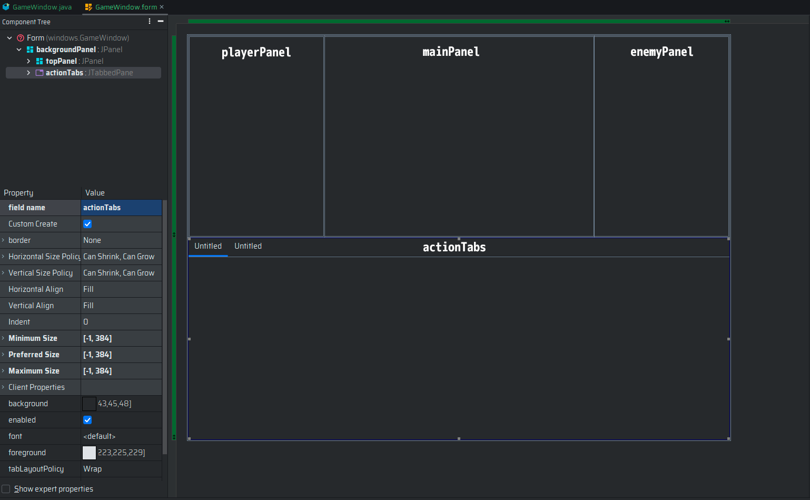

Una vez que hemos visto la estructura general del proyecto, es momento de hablar sobre la ventana principal del juego.
En este apartado, vamos a definir los elementos que conforman la ventana principal y cómo se relacionan entre sí.

## Objetivo

El objetivo de este apartado es definir los elementos de la ventana principal y cómo se relacionan entre sí. La ventana
principal es la parte del juego que se muestra al jugador al iniciar el juego, por lo tanto, es importante que sea clara
y fácil de entender.

## Elementos de la Ventana Principal

La ventana principal está compuesta por varios elementos que permiten al jugador interactuar con el juego. Algunos de
los elementos más comunes son:

- **Fondo**: Representa el entorno en el que se encuentra el jugador.
- **Personaje**: Representa al jugador y se puede mover por la pantalla.
- **Enemigos**: Representan a los enemigos con los que el jugador puede interactuar.
- **Objetos**: Representan objetos con los que el jugador puede interactuar.
- **HUD (Heads-Up Display)**: Muestra información importante como la vida, la energía o el inventario del jugador.
- **Menús**: Permiten al jugador acceder a diferentes opciones como el inventario, el mapa o las opciones del juego.
- **Texto**: Muestra información al jugador como diálogos, instrucciones o mensajes de error.
- **Iconos**: Representan objetos, habilidades o estados del jugador.
- **Botones**: Permiten al jugador realizar acciones como atacar, moverse o interactuar con objetos.
- **Barra de Vida**: Muestra la cantidad de vida que tiene el jugador o un enemigo.
- **Barra de Energía**: Muestra la cantidad de energía que tiene el jugador o un enemigo.
- **Barra de Experiencia**: Muestra la cantidad de experiencia que tiene el jugador.

## La clase `GameWindow`

La clase `GameWindow` es la encargada de gestionar la ventana principal del juego. Esta clase se encarga de inicializar
los elementos de la ventana principal, como el fondo, el personaje, los enemigos, los objetos, el HUD, los menús, el
texto, los iconos, los botones, las barras de vida, las barras de energía y la barra de experiencia.

La clase `GameWindow` también se encarga de gestionar la interacción entre los diferentes elementos de la ventana
principal, como las acciones del personaje, los ataques de los enemigos y los objetos, la actualización del HUD y las
barras de vida, energía y experiencia, la apertura y cierre de los menús, la visualización del texto y los iconos, y la
respuesta a los botones pulsados por el jugador.

Para crear nuestra clase, usaremos el editor de interfaces integrado de IntelliJ IDEA. Para ello, seguiremos los
siguientes pasos:

1. Abre IntelliJ IDEA y crea un paquete llamado `gui` en el directorio `src`.
2. Haz clic derecho en el paquete `gui` y selecciona `New -> Swing UI Designes -> GUI Form`.
3. Coloca como nombre `GameWindow` y haz clic en `OK`.
4. Selecciona la clase creada y haz que esta extienda de `JFrame`.
5. Diseña la interfaz de la ventana principal con los elementos mencionados anteriormente de la siguiente manera:
    1. Divide la ventana en dos paneles, un panel superior para información del usuario, el enemigo y el sistema,
       mientras el segundo es el panel de menús de acción.
    2. En el panel superior, coloca un panel para el personaje, un panel para el enemigo y un panel para el sistema.
    3. En el panel de menús, coloca un `JTabbedPane` para los menús del jugador.
    4. Puedes guiarte de la siguiente imagen:
       
6. Cada una de las secciones de la ventana principal debe ser un panel separado unas dimensiones específicas:
    1. La ventana completa debe tener un tamaño de 1024x768 pixeles. En este caso es el panel inicial que aparece al
       crear la interfaz. Es por ello que lo llamamos `backgroundPanel`.
    2. El panel superior es un JPanel que debe tener un tamaño de 1024x384 pixeles y se llamará `topPanel`.
       Se dividirá como en la imagen previa.
        1. El panel del personaje debe ser un JPanel y tener un tamaño de 256x384 pixeles y se llamará `playerPanel`.
        2. El panel del enemigo debe ser un JPanel y tener un tamaño de 256x384 pixeles y se llamará `enemyPanel`.
        3. El panel del sistema debe ser un JPanel y tener un tamaño de 512x384 pixeles y se llamará `mainPanel`.
    3. El panel debe ser un JTabbedPane y tener un tamaño de 1024x384 pixeles y se llamará `actionsPanel`.
7. Para nuestra ventana, marcaremos que los elementos playerPanel, enemyPanel, mainPanel y actionsPanel serán creado con
   un Custom Create esto creara la función `createUIComponents` en nuestra clase de Java.
8. Puedes Cerrar el editor una vez que hayas arrastrado los objetos en el editor y proceder al
   archivo `GameWindow.java`.

## Implementación de la clase `GameWindow`

Una vez que hayas diseñado la interfaz de la ventana principal, puedes proceder a implementar la clase `GameWindow` en
el archivo `GameWindow.java`. Para ello, sigue los siguientes pasos:

1. Abre el archivo `GameWindow.java` y agrega los siguientes atributos a la clase:
    ```java
    private static GameWindow instance;
    private Player player;
    private Enemy enemy;
    ```
2. Agrega el siguiente método para obtener la instancia de la clase:
    ```java
    public static GameWindow getInstance(Player player) {
        if (instance == null) {
            instance = new GameWindow(player);
        }
        return instance;
    }
    ```
3. Agrega el siguiente constructor a la clase:
    ```java
    private GameWindow(Player player) {
        this.player = player;
        this.enemy = new Enemy();
        startGame();
    }
    ```
4. Agrega el siguiente método para iniciar el juego:
    ```java
    private void startGame() {
        //Título de la Ventana
        setTitle("Game Window");
        //Operación por defecto de cierre
        setDefaultCloseOperation(JFrame.EXIT_ON_CLOSE);
        //No la hacemos escalable
        setResizable(false);
        //Agregamos el panel principal
        add(backgroundPanel);
        //Tamaño de la ventana
        pack();
        //Centramos la ventana
        setLocationRelativeTo(null);
        //Hacemos visible la ventana
        setVisible(true);
    }
    ```
5. Creamos los componentes personalizados en la clase `GameWindow`:
    ```java
   private void createUIComponents() {
       //Agregamos el panel del jugador
       playerPanel = PlayerPanel.getInstance(player);
       //Agregamos el enemigo
       enemy = EnemyFactory.generateRegularEnemy(player);
       //Agregamos el panel del enemigo
       enemyPanel = EnemyPanel.getInstance(enemy);
       //Agregamos el panel principal
       mainPanel = MainPanel.getInstance(enemy);
       //Agregamos las pestañas
       actionTabs = ActionsPanel.getInstance();
       //Agregamos el panel de estado
       statusPanel = StatusPanel.getInstance(0);
       //Agregamos el panel de batalla
       battlePanel = BattlePanel.getInstance(1);
   }
    ```

Si seguimos estos pasos nuestra clase se debería de ver de la siguiente manera:

```java
    public class GameWindow extends JFrame {

        private static GameWindow instance;
        private JPanel backgroundPanel;
        private Player player;
        private Enemy enemy;
        private JTabbedPane actionTabs;
        private JPanel topPanel;
        private JPanel playerPanel;
        private JPanel enemyPanel;
        private JPanel mainPanel;
        private JPanel statusPanel;
        private JPanel battlePanel;
    
        public static GameWindow getInstance(Player player) {
    
            //Si la instancia es nula, la creamos
            if (instance == null) {
    
                instance = new GameWindow(player);
            }
            //Devolvemos la instancia
            return instance;
        }
    
        private GameWindow(Player player) {
    
            this.player = player;
        }
    
        public void startGame() {
    
            //Título de la Ventana
            setTitle("Game Window");
            //Operación por defecto de cierre
            setDefaultCloseOperation(JFrame.EXIT_ON_CLOSE);
            //No la hacemos escalable
            setResizable(false);
            //Agregamos el panel principal
            add(backgroundPanel);
            //Tamaño de la ventana
            pack();
            //Centramos la ventana
            setLocationRelativeTo(null);
            //Hacemos visible la ventana
            setVisible(true);
        }
    
        private void createUIComponents() {
    
            //Agregamos el panel del jugador
            playerPanel = PlayerPanel.getInstance(player);
            //Agregamos el enemigo
            enemy = EnemyFactory.generateRegularEnemy(player);
            //Agregamos el panel del enemigo
            enemyPanel = EnemyPanel.getInstance(enemy);
            //Agregamos el panel principal
            mainPanel = MainPanel.getInstance(enemy);
            //Agregamos las pestañas
            actionTabs = ActionsPanel.getInstance();
            //Agregamos el panel de estado
            statusPanel = StatusPanel.getInstance(0);
            //Agregamos el panel de batalla
            battlePanel = BattlePanel.getInstance(1);
        }
    }
```

> [!important]
> Recuerda que debes crear las funciones get de los atributos de la ventana para tener acceso fuera de la clase.

Con esto, hemos creado la clase `GameWindow` que se encarga de gestionar la ventana principal del juego. En el siguiente
apartado, veremos cómo implementar los elementos de la ventana principal, como el fondo, el personaje, los enemigos, los
objetos, el HUD, los menús, el texto, los iconos, los botones, las barras de vida, las barras de energía y la barra de
experiencia.

Las clases `PlayerPanel`, `EnemyPanel`, `MainPanel`, `ActionsPanel`, `StatusPanel` y `BattlePanel` son clases que
representan los paneles de la ventana principal y se encargan de gestionar la información y la interacción entre los
elementos de la ventana principal. En el siguiente apartado, veremos cómo implementar estas clases y cómo se relacionan
entre sí.
