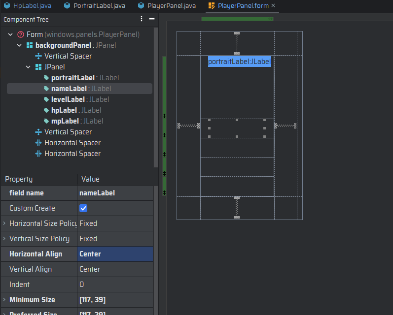

# El panel del jugador

El panel del jugador es una interfaz que muestra información sobre el jugador y su estado actual. Este panel se muestra
en la parte inferior de la pantalla y se puede ocultar o mostrar en cualquier momento.

El panel del jugador muestra la siguiente información:

- **Imagen del Jugador**: Muestra la imagen del jugador.
- **Nombre del jugador**: Muestra el nombre del jugador.
- **Vida**: Muestra la vida actual del jugador.
- **Energía**: Muestra la energía actual del jugador.
- **Nivel**: Muestra el nivel actual del jugador.
- **Barra de vida**: Muestra la barra de vida del jugador.
- **Barra de energía**: Muestra la barra de energía del jugador.

## Implementación de la clase `PlayerPanel`

Al igual que `GameWindow`, `PlayerPanel` es una clase que extiende de `JPanel`. Así que deberemos de crear esta clase
siguiendo el mismo proceso de creación de la clase `GameWindow`.

Una vez creada la clase y el formulario de la interfaz, deberemos de agregar los componentes necesarios para mostrar la
información del jugador. Para ello, deberemos de agregar los siguientes componentes:

- **JLabel**: Para mostrar la imagen del jugador.
    - Con un tamaño de 117x127 pixeles.
- **JLabel**: Para mostrar el nombre del jugador.
    - Con un tamaño de 117x39 pixeles.
- **JLabel**: Para mostrar el nivel del jugador.
    - Con un tamaño de 117x39 pixeles.
- **JLabel**: Para mostrar la barra de vida del jugador.
    - Con un tamaño de 146x39 pixeles.
- **JLabel**: Para mostrar la barra de energía del jugador.
    - Con un tamaño de 146x39 pixeles.

Por lo cual la interfaz se verá de la siguiente manera:



Una vez agregados los componentes, deberemos de implementar los métodos necesarios para actualizar la información del
jugador. Para ello, deberemos de implementar los siguientes métodos:

```java
    package windows.panels;
    
    import player.Player;
    import windows.GameWindow;
    import windows.labels.HpLabel;
    import windows.labels.MpLabel;
    import windows.labels.PortraitLabel;
    import windows.labels.RedTextLabel;
    
    import javax.swing.*;
    import java.awt.*;
    
    public class PlayerPanel extends JPanel {
    
        private static PlayerPanel instance;
        private final Player player;
        private JPanel backgroundPanel;
        private JLabel portraitLabel;
        private JLabel nameLabel;
        private JLabel levelLabel;
        private JLabel hpLabel;
        private JLabel mpLabel;

        public static PlayerPanel getInstance(Player player) {
    
            if (instance == null) {
    
                instance = new PlayerPanel(player);
            }
            return instance;
        }

        private PlayerPanel(Player player) {
    
            this.player = Player.getInstance();
            add(backgroundPanel);
        }

        @Override
        public void paintComponent(Graphics g) {
    
            super.paintComponent(g);
            Graphics2D g2d = (Graphics2D) g;
            Image image = new ImageIcon("img/ui/panels/playerPanel.png").getImage();
            g2d.setRenderingHint(RenderingHints.KEY_INTERPOLATION, RenderingHints.VALUE_INTERPOLATION_BILINEAR);
            g2d.setRenderingHint(RenderingHints.KEY_RENDERING, RenderingHints.VALUE_RENDER_QUALITY);
            g2d.setRenderingHint(RenderingHints.KEY_ANTIALIASING, RenderingHints.VALUE_ANTIALIAS_ON);
            g2d.drawImage(image, 0, 0, 256, 384, null);
        }

        private void createUIComponents() {
    
            //Agregamos la etiqueta del retrato
            portraitLabel = new PortraitLabel();
            //Agregamos la etiqueta del nombre
            nameLabel = new RedTextLabel(Player.getInstance().getName());
            //Agregamos la etiqueta del nivel
            levelLabel = new RedTextLabel("Nivel: " + Player.getInstance().getLevel());
            //Agregamos la etiqueta de los puntos de vida
            hpLabel = new HpLabel(Player.getInstance());
            //Agregamos la etiqueta de los puntos de maná
            mpLabel = new MpLabel(Player.getInstance());
        }
    }
```

En este código, se ha implementado el método `updatePlayer` que se encarga de actualizar la información del jugador en
el
panel. Este método recibe un objeto de tipo `Player` y actualiza la información del jugador en el panel.

Además, se ha implementado el método `paintComponent` que se encarga de pintar el fondo del panel. Este método recibe un
objeto de tipo `Graphics` y pinta el fondo del panel.

Finalmente, se ha implementado el método `paintBackground` que se encarga de pintar el fondo del panel. Este método
recibe un objeto de tipo `Graphics2D` y pinta el fondo del panel.

## Implementación de la clase `PortraitLabel`

La clase `PortraitLabel` es una clase que extiende de `JLabel` y se encarga de mostrar la imagen del jugador en el panel
del jugador. Para ello, deberemos de crear esta clase siguiendo el mismo proceso de creación de la clase `GameWindow`.

Una vez creada la clase, deberemos de implementar los métodos necesarios para mostrar la imagen del jugador. Para ello,
deberemos de implementar el método `paintComponent` que se encarga de pintar la imagen del jugador en el panel.

```java
    package gui.labels;
    
    import javax.swing.*;
    import java.awt.*;
    
    /**
     * Clase que representa una etiqueta con la imagen de un retrato
     */
    public class PortraitLabel extends JLabel {
    
        /**
         * Constructor de la clase
         */
        public PortraitLabel() {
    
            super();
            Dimension size = new Dimension(117, 127);
            setSize(size);
            setPreferredSize(size);
            setMaximumSize(size);
            setMinimumSize(size);
        }
    
        /**
         * Método que pinta el componente
         *
         * @param g gráficos
         */
        @Override
        public void paint(Graphics g) {
    
            super.paint(g);
            Graphics2D g2d = (Graphics2D) g;
            Image image = new ImageIcon("img/player/portrait.png").getImage();
            g2d.setRenderingHint(RenderingHints.KEY_INTERPOLATION, RenderingHints.VALUE_INTERPOLATION_BILINEAR);
            g2d.setRenderingHint(RenderingHints.KEY_RENDERING, RenderingHints.VALUE_RENDER_QUALITY);
            g2d.setRenderingHint(RenderingHints.KEY_ANTIALIASING, RenderingHints.VALUE_ANTIALIAS_ON);
            g2d.drawImage(image, 0, 0, null);
        }
    }
```

En este código, se ha implementado el método `paintComponent` que se encarga de pintar la imagen del jugador en el
panel.

## Implementación de la clase `HpLabel`

La clase `HpLabel` es una clase que extiende de `JLabel` y se encarga de mostrar la barra de vida del jugador en el
panel del jugador. Para ello, deberemos de crear esta clase siguiendo el mismo proceso de creación de la
clase `GameWindow`.

Una vez creada la clase, deberemos de implementar los métodos necesarios para mostrar la barra de vida del jugador. Para
ello, deberemos de implementar el método `paintComponent` que se encarga de pintar la barra de vida del jugador en el
panel.

```java
    package gui.labels;
    
    import characters.BasicCharacter;
    import util.managers.ImageManager;
    
    import javax.swing.*;
    import java.awt.*;
    
    public class HpLabel extends JLabel {
    
        private BasicCharacter character;
        private Image image;
        private String displayText;
    
        public HpLabel(BasicCharacter character) {
    
            super(character.getName());
            this.character = character;
            init();
            Font font = new Font("Arial", Font.BOLD, 15);
            Dimension size = new Dimension(image.getWidth(null), image.getHeight(null) + 10);
            setPreferredSize(size);
            setMinimumSize(size);
            setMaximumSize(size);
            setSize(size);
            setBorder(BorderFactory.createEmptyBorder(10, 0, 0, 0));
            setFont(font);
        }
    
        private void init() {
    
            displayText = String.format("%d/%d", character.getHp(), character.getMaxHp());
            double hpPercentage = (double) character.getHp() / character.getMaxHp();
            ImageManager imageManager = ImageManager.getInstance();
            Color color;
            if (hpPercentage >= .8) {
                image = imageManager.getImage("hp100");
                color = new Color(0, 0, 0, 255);
            } else if (hpPercentage > 0.6) {
                image = imageManager.getImage("hp80");
                color = new Color(0, 0, 0, 255);
            } else if (hpPercentage > 0.4) {
                imageManager.getImage("h60");
                color = new Color(109, 109, 109, 255);
            } else if (hpPercentage > 0.2) {
                imageManager.getImage("hp40");
                color = new Color(109, 109, 109, 255);
            } else if (hpPercentage > 0) {
                imageManager.getImage("hp20");
                color = new Color(109, 109, 109, 255);
            } else {
                imageManager.getImage("hp0");
                color = new Color(255, 255, 255, 255);
            }
            setForeground(color);
        }
    
        public void updateCharacter(BasicCharacter character) {
    
            this.character = character;
            init();
            repaint();
        }
    
        @Override
        protected void paintComponent(Graphics g) {
    
            super.paintComponent(g);
            Graphics2D g2d = (Graphics2D) g;
            g2d.setRenderingHint(RenderingHints.KEY_INTERPOLATION, RenderingHints.VALUE_INTERPOLATION_BILINEAR);
            g2d.setRenderingHint(RenderingHints.KEY_RENDERING, RenderingHints.VALUE_RENDER_QUALITY);
            g2d.setRenderingHint(RenderingHints.KEY_ANTIALIASING, RenderingHints.VALUE_ANTIALIAS_ON);
            g2d.setRenderingHint(RenderingHints.KEY_TEXT_ANTIALIASING, RenderingHints.VALUE_TEXT_ANTIALIAS_ON);
            g2d.drawImage(image, 0, 10, null);
            int textPositionY = image.getHeight(null) / 2 + 11 + g2d.getFontMetrics().getHeight() / 4;
            int textPositionX = ((image.getWidth(null) - 28) / 2) + 28 - (g2d.getFontMetrics().stringWidth(displayText) / 2);
            g2d.translate(textPositionX, textPositionY);
            g2d.drawString(displayText, 0, 0);
        }
    }
```

En este código, se ha implementado el método `paintComponent` que se encarga de pintar la barra de vida del jugador en
el panel.

## Implementación de la clase `MpLabel`

La clase `MpLabel` es una clase que extiende de `JLabel` y se encarga de mostrar la barra de energía del jugador en el
panel del jugador.

Una vez creada la clase, deberemos de implementar los métodos necesarios para mostrar la barra de energía del jugador.
Para ello, deberemos de implementar el método `paintComponent` que se encarga de pintar la barra de energía del jugador
en el panel.

```java
    package gui.labels;
    
    import characters.BasicCharacter;
    
    import javax.swing.*;
    import java.awt.*;
    
    public class MpLabel extends JLabel {
    
        private BasicCharacter character;
        private Image image;
        private String displayText;
    
        public MpLabel(BasicCharacter character) {
    
            super(character.getName());
            this.character = character;
            init();
            Font font = new Font("Arial", Font.BOLD, 15);
            Dimension size = new Dimension(image.getWidth(null), image.getHeight(null) + 10);
            setPreferredSize(size);
            setMinimumSize(size);
            setMaximumSize(size);
            setSize(size);
            setBorder(BorderFactory.createEmptyBorder(10, 0, 0, 0));
            setFont(font);
        }
    
        private void init() {
    
            displayText = String.format("%d/%d", character.getMp(), character.getMaxMp());
            double hpPercentage = (double) character.getMp() / character.getMaxMp();
            Color color;
            if (hpPercentage >= .8) {
                image = new ImageIcon("img/player/mp100.png").getImage();
                color = new Color(0, 0, 0, 255);
            } else if (hpPercentage > 0.6) {
                image = new ImageIcon("img/player/mp80.png").getImage();
                color = new Color(0, 0, 0, 255);
            } else if (hpPercentage > 0.4) {
                image = new ImageIcon("img/player/mp60.png").getImage();
                color = new Color(109, 109, 109, 255);
            } else if (hpPercentage > 0.2) {
                image = new ImageIcon("img/player/mp40.png").getImage();
                color = new Color(109, 109, 109, 255);
            } else if (hpPercentage > 0) {
                image = new ImageIcon("img/player/mp20.png").getImage();
                color = new Color(109, 109, 109, 255);
            } else {
                image = new ImageIcon("img/player/mp0.png").getImage();
                color = new Color(255, 255, 255, 255);
            }
            setForeground(color);
        }
    
        public void updateCharacter(BasicCharacter character) {
    
            this.character = character;
            init();
            repaint();
        }
    
        @Override
        protected void paintComponent(Graphics g) {
    
            super.paintComponent(g);
            Graphics2D g2d = (Graphics2D) g;
            g2d.setRenderingHint(RenderingHints.KEY_INTERPOLATION, RenderingHints.VALUE_INTERPOLATION_BILINEAR);
            g2d.setRenderingHint(RenderingHints.KEY_RENDERING, RenderingHints.VALUE_RENDER_QUALITY);
            g2d.setRenderingHint(RenderingHints.KEY_ANTIALIASING, RenderingHints.VALUE_ANTIALIAS_ON);
            g2d.setRenderingHint(RenderingHints.KEY_TEXT_ANTIALIASING, RenderingHints.VALUE_TEXT_ANTIALIAS_ON);
            g2d.drawImage(image, 0, 10, null);
            int textPositionY = image.getHeight(null) / 2 + 11 + g2d.getFontMetrics().getHeight() / 4;
            int textPositionX = ((image.getWidth(null) - 28) / 2) -
                                (g2d.getFontMetrics().stringWidth(displayText) / 2) - 7;
            g2d.translate(textPositionX, textPositionY);
            g2d.drawString(displayText, 0, 0);
        }
    }
```

En este código, se ha implementado el método `paintComponent` que se encarga de pintar la barra de energía del jugador
en el panel.

## Implementación de la clase `RedTextLabel`

La clase `RedTextLabel` es una clase que extiende de `JLabel` y se encarga de mostrar el nombre y el nivel del jugador
en el panel del jugador.

Una vez creada la clase, deberemos de implementar los métodos necesarios para mostrar el nombre y el nivel del jugador.
Para ello, deberemos de implementar el método `paintComponent` que se encarga de pintar el nombre y el nivel del jugador
en el panel.

```java
    package gui.labels;
    
    import javax.swing.*;
    import java.awt.*;
   
    public class RedTextLabel extends JLabel {

        protected String displayText;

        public RedTextLabel(String text) {
    
            super();
            //Establecemos el texto
            this.displayText = text;
            //Establecemos las propiedades del componente
            Dimension size = new Dimension(117, 39);
            setPreferredSize(size);
            setMaximumSize(size);
            setMinimumSize(size);
            setOpaque(false);
            setFont(new Font("Arial", Font.BOLD, 15));
            setForeground(Color.BLACK);
            //Añadimos un borde invisible superior de 10px para separar el texto del borde
            setBorder(BorderFactory.createEmptyBorder(10, 0, 0, 0));
        }

        @Override
        protected void paintComponent(Graphics g) {
    
            super.paintComponent(g);
            Graphics2D g2d = (Graphics2D) g;
            //Cargamos la imagen de fondo
            Image image = new ImageIcon("img/ui/holders/textHolder.png").getImage();
            //Activamos la interpolación
            g2d.setRenderingHint(RenderingHints.KEY_INTERPOLATION, RenderingHints.VALUE_INTERPOLATION_BILINEAR);
            g2d.setRenderingHint(RenderingHints.KEY_RENDERING, RenderingHints.VALUE_RENDER_QUALITY);
            g2d.setRenderingHint(RenderingHints.KEY_ANTIALIASING, RenderingHints.VALUE_ANTIALIAS_ON);
            g2d.setRenderingHint(RenderingHints.KEY_TEXT_ANTIALIASING, RenderingHints.VALUE_TEXT_ANTIALIAS_ON);
            g2d.drawImage(image, 0, 10, null);
            //Calculamos la posición del texto
            int textPositionY = image.getHeight(null) / 2 + (g2d.getFontMetrics().getHeight() / 2) + 6;
            int textPositionX = (image.getWidth(null) - g2d.getFontMetrics().stringWidth(displayText)) / 2;
            //Pintamos el texto
            g2d.drawString(displayText, textPositionX, textPositionY);
        }
    }
```

En este código, se ha implementado el método `paintComponent` que se encarga de pintar el nombre y el nivel del jugador
en el panel.
