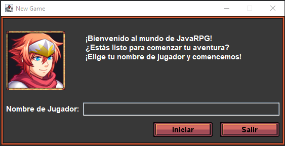

# La ventana de nuevo juego

En esta ventana podremos crear un nuevo juego con las opciones que queramos. Para acceder a ella, simplemente debemos
ejecutar el programa.



## Paso 1: Crear el formulario

1. Abra IntelliJ IDEA y vaya a Archivo > Nuevo > Formulario GUI.
2. En la ventana emergente, elija un nombre para su formulario (por ejemplo, NewGameWindow).
3. Seleccione el administrador de diseño como GridLayoutManager.
4. Marque la opción Crear clase vinculada y especifique el nombre de clase deseado (por ejemplo, gui.NewGameWindow).
5. Haga clic en Aceptar.

## Paso 2: Diseñar el formulario

1. El formulario se abrirá en la vista de diseño. Verá un diseño de cuadrícula con dos filas y una columna inicialmente.
2. Agregue otro diseño de cuadrícula con dos filas y dos columnas dentro de la primera fila de la cuadrícula principal.
3. Esto se usará para la sección de información del jugador.

## Paso 3: Agregar componentes

### Información del jugador:

1. En la segunda fila de la cuadrícula interna, agregue un componente JTextField llamado playerName.
2. Agregue un componente JLabel en la primera fila de la cuadrícula interna y establezca su texto en "Nombre de
   Jugador:".

### Texto de bienvenida:

1. En la cuadrícula interna, agregue otro diseño de cuadrícula (JPanel) con dos filas y dos columnas.
2. Agregue un componente JTextArea en la segunda fila de nombre welcomeText.
3. Agregue un componente vspacer en la primera fila para crear un espacio encima del área de texto.
4. Agregue un componente JLabel en la primera fila de nombre portraitLabel. Establezca su tamaño
   preferido en 117x127 píxeles.

### Botones:

1. En la segunda fila de la cuadrícula principal, agregue otro diseño de cuadrícula (JPanel) con una fila y cuatro
   columnas.
2. Agregue tres componentes JButton. Vincule dos de ellos a las variables startButton y exitButton. Establezca su texto
   en "Botón" inicialmente.
3. Agregue un componente hspacer en la primera columna para crear un espacio entre el borde y los botones.

## Paso 4: Ajustar propiedades

1. Establezca el tamaño preferido del panel principal (backgroundPanel) en 560x254 píxeles con márgenes.
2. Ajuste los márgenes del campo de texto y la etiqueta para la información del jugador.
3. Establezca el texto de los botones como desee.

## Paso 5: Notas adicionales

1. Puede personalizar aún más la apariencia del formulario cambiando las fuentes, los colores y los bordes de los
   componentes.

## Clase NewGameWindow

La ventana de nuevo juego es muy sencilla, pero es la base para poder jugar. En la siguiente ventana, podremos ver cómo
se ve el juego en sí.

```java
    package gui;
    
    import gui.buttons.ExitButton;
    import gui.buttons.StartButton;
    import gui.labels.PortraitLabel;
    import util.managers.FontManager;
    import util.managers.ImageManager;
    
    import javax.swing.*;
    import java.awt.*;
    
    public class NewGameWindow extends JFrame {
    
        private JPanel backgroundPanel;
        private JButton exitButton;
        private JButton startButton;
        private JTextArea welcomeText;
        private JTextField playerName;
        private JLabel playerLabel;
        private JLabel portraitLabel;
    
        public NewGameWindow() {
    
            setTitle("New Game");
            add(backgroundPanel);
            pack();
            setDefaultCloseOperation(JFrame.DO_NOTHING_ON_CLOSE);
            setLocationRelativeTo(null);
            setResizable(false);
            setVisible(true);
            welcomeText.append("¡Bienvenido al mundo de JavaRPG!\n");
            welcomeText.append("¿Estás listo para comenzar tu aventura?\n");
            welcomeText.append("¡Elige tu nombre de jugador y comencemos!");
            welcomeText.setOpaque(false);
            welcomeText.setEditable(false);
            welcomeText.setFont(FontManager.getInstance().getFont("Standard"));
            welcomeText.setForeground(Color.WHITE);
            playerName.setFont(FontManager.getInstance().getFont("Standard"));
            playerName.setForeground(Color.WHITE);
            playerLabel.setFont(FontManager.getInstance().getFont("Standard"));
            playerLabel.setForeground(Color.WHITE);
        }
    
        private void createUIComponents() {
    
            backgroundPanel = new JPanel() {
    
                @Override
                public void paintComponent(Graphics g) {
    
                    super.paintComponent(g);
                    Graphics2D g2d = (Graphics2D) g;
                    g2d.setRenderingHint(RenderingHints.KEY_ANTIALIASING, RenderingHints.VALUE_ANTIALIAS_ON);
                    g2d.drawImage(ImageManager.getInstance().getImage("skillPanel"), 0, 0, null);
                }
            };
            portraitLabel = new PortraitLabel();
            startButton = new StartButton(this);
            exitButton = new ExitButton();
        }
    
        public String getPlayerName() {
    
            return playerName.getText();
        }
    }
```
