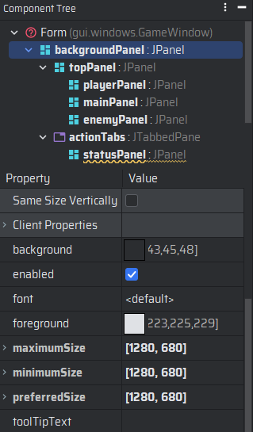
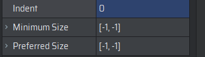

## Redimensionar la Ventana

Para que nuestra aplicación pueda apreciarse adecuadamente en diversas resoluciones, deberemos de tomar la resolución
más pequeña y óptima, por lo cual crearemos una interfaz que nos permita redimensionar la ventana de la aplicación.

### Crear la Interfaz

Crea una nueva Interfaz de Java llamada `Dimensions` dentro del paquete `util.interfaces` y agrega los siguientes
componentes:

```java
    package util.interfaces;
    
    import java.awt.*;
    
    public interface Dimensions {
    
        Dimension SCREEN_SIZE = new Dimension(1280, 680);
        Dimension TOP_PANEL_SIZE = new Dimension(1280, 300);
        Dimension SIDE_PANEL_SIZE = new Dimension(256, 300);
        Dimension MAIN_PANEL_SIZE = new Dimension(768, 300);
        Dimension DIALOG_PANEL_SIZE = new Dimension(768, 150);
        Dimension DIALOG_SCROLL_SIZE = new Dimension(748, 140);
        Dimension TAB_SIZE = new Dimension(1275, 340);
        Dimension SPRITE_SIZE = new Dimension(256, 140);
        Dimension PLAYER_SPRITE_SIZE = new Dimension(65, 85);
        Dimension BUTTON_SIZE = new Dimension(128, 32);
        Dimension LABEL_SIZE = new Dimension(128, 32);
    }
```

### Redimensionar la Ventana

Dentro de la clase `GameWindow` deberemos de agregar un método que nos permita redimensionar la ventana de la aplicación
de acuerdo a las dimensiones de la interfaz `Dimensions`.

```java
    package window;
    
    import util.interfaces.Dimensions;
    
    import javax.swing.*;
    import java.awt.*;
    
    public class GameWindow extends JFrame {
    
        public void startGame() {

            setPanelsSize();
            //Título de la Ventana
            setTitle("Game Window");
            //Operación por defecto de cierre
            setDefaultCloseOperation(JFrame.DO_NOTHING_ON_CLOSE);
            //No la hacemos escalable
            setResizable(false);
            //Agregamos el panel principal
            add(backgroundPanel);
            //Tamaño de la ventana
            pack();
            //Centramos la ventana
            setLocationRelativeTo(null);
            //Hacemos visible la ventana
            setVisible(true);
        }
    
        private void setPanelsSize() {
        	
            //Panel de fondo
            backgroundPanel.setSize(Dimensions.SCREEN_SIZE);
            backgroundPanel.setPreferredSize(Dimensions.SCREEN_SIZE);
            backgroundPanel.setMaximumSize(Dimensions.SCREEN_SIZE);
            backgroundPanel.setMinimumSize(Dimensions.SCREEN_SIZE);
            //Panel superior
            topPanel.setSize(Dimensions.TOP_PANEL_SIZE);
            topPanel.setPreferredSize(Dimensions.TOP_PANEL_SIZE);
            topPanel.setMaximumSize(Dimensions.TOP_PANEL_SIZE);
            topPanel.setMinimumSize(Dimensions.TOP_PANEL_SIZE);
            System.out.println(topPanel.getSize());
            //Panel Principal
            mainPanel.setSize(Dimensions.MAIN_PANEL_SIZE);
            mainPanel.setPreferredSize(Dimensions.MAIN_PANEL_SIZE);
            mainPanel.setMaximumSize(Dimensions.MAIN_PANEL_SIZE);
            mainPanel.setMinimumSize(Dimensions.MAIN_PANEL_SIZE);
            //Panel de Jugador
            playerPanel.setSize(Dimensions.SIDE_PANEL_SIZE);
            playerPanel.setPreferredSize(Dimensions.SIDE_PANEL_SIZE);
            playerPanel.setMaximumSize(Dimensions.SIDE_PANEL_SIZE);
            playerPanel.setMinimumSize(Dimensions.SIDE_PANEL_SIZE);
            //Panel de Enemigo
            enemyPanel.setSize(Dimensions.SIDE_PANEL_SIZE);
            enemyPanel.setPreferredSize(Dimensions.SIDE_PANEL_SIZE);
            enemyPanel.setMaximumSize(Dimensions.SIDE_PANEL_SIZE);
            enemyPanel.setMinimumSize(Dimensions.SIDE_PANEL_SIZE);
        }
    }
```

En caso de que la ventana aún no se muestre con el nuevo tamaño, deberemos de modificar las dimensiones de los paneles
desde la vista de diseño de IntelliJ IDEA.

### Modificar las Dimensiones de los Paneles

Para modificar las dimensiones de los paneles desde la vista de diseño de IntelliJ IDEA, deberemos de seleccionar el
panel que deseamos modificar y en la sección de propiedades, modificar los valores de `preferredSize`, `maximumSize`
y `minimumSize` de acuerdo a las dimensiones de la interfaz `Dimensions`.



> [!important] **Nota:**
> Este proceso deberemos de hacerlo con las clases que se señalan a continuación también, esto para asegurarnos de
> que la ventana se redimensione correctamente.

## PlayerPanel

```java
    package panel;
    
    import util.interfaces.Dimensions;
    
    import javax.swing.*;
    import java.awt.*;
    
    public class PlayerPanel extends BackGroundPanel {
    
        public static PlayerPanel getInstance(Player player) {
    
            if (instance == null) {
    
                instance = new PlayerPanel(player, ImageManager.getInstance().getImage("playerPanel"),
                        Dimensions.SIDE_PANEL_SIZE);
            }
            return instance;
        }
    
        private PlayerPanel(Player player, Image image, Dimension dimension) {
    
            super(image, dimension);
            this.player = player;
            add(mainPanel);
            update();
            mainPanel.setSize(dimension);
            mainPanel.setPreferredSize(dimension);
            mainPanel.setMaximumSize(dimension);
            mainPanel.setMinimumSize(dimension);
        }
    }
```

## EnemyPanel

```java
    package panel;
    
    import util.interfaces.Dimensions;
    
    import javax.swing.*;
    import java.awt.*;
    
    public class EnemyPanel extends BackGroundPanel {
    
        public static EnemyPanel getInstance(Enemy enemy) {
    
            if (instance == null) {
    
                instance = new EnemyPanel(enemy, ImageManager.getInstance().getImage("enemyPanel"),
                        Dimensions.SIDE_PANEL_SIZE);
            }
            return instance;
        }
    
        private EnemyPanel(Enemy enemy, Image image, Dimension dimension) {
    
            super(image, dimension);
            this.enemy = enemy;
            add(mainPanel);
            update();
            mainPanel.setSize(dimension);
            mainPanel.setPreferredSize(dimension);
            mainPanel.setMaximumSize(dimension);
            mainPanel.setMinimumSize(dimension);
        }
    }
```

## MainPanel

```java
    package panel;
    
    import util.interfaces.Dimensions;
    
    import javax.swing.*;
    import java.awt.*;
    
    public class MainPanel extends BackGroundPanel {
    
        public static MainPanel getInstance() {
    
            if (instance == null) {
    
                instance = new MainPanel(ImageManager.getInstance().getImage("mainPanel"),
                        Dimensions.MAIN_PANEL_SIZE);
            }
            return instance;
        }
    
        private MainPanel(Enemy enemy, Player player, Image image, Dimension dimension) {
    
            super(image, dimension);
            this.enemy = enemy;
            this.player=player;
            mainPanel.setSize(dimension);
            mainPanel.setPreferredSize(dimension);
            mainPanel.setMaximumSize(dimension);
            mainPanel.setMinimumSize(dimension);
            spritesPanel.setSize(Dimensions.DIALOG_PANEL_SIZE);
            spritesPanel.setPreferredSize(Dimensions.DIALOG_PANEL_SIZE);
            spritesPanel.setMaximumSize(Dimensions.DIALOG_PANEL_SIZE);
            spritesPanel.setMinimumSize(Dimensions.DIALOG_PANEL_SIZE);
            add(mainPanel);
        }
    }
```

## DialogPanel

```java
    package panel;
    
    import util.interfaces.Dimensions;
    
    import javax.swing.*;
    import java.awt.*;
    
    public class DialogPanel extends BackGroundPanel {
    
        public static DialogPanel getInstance() {
        
            if (instance == null) {
        
                instance = new DialogPanel(ImageManager.getInstance().getImage("dialogPanel"),
                        Dimensions.DIALOG_PANEL_SIZE);
            }
            return instance;
        }
        
        private DialogPanel(Image image, Dimension dimension) {
        
            super(image, dimension);
            add(mainPanel);
            mainPanel.setSize(dimension);
            mainPanel.setPreferredSize(dimension);
            mainPanel.setMaximumSize(dimension);
            mainPanel.setMinimumSize(dimension);
            mainPanel.setBorder(BorderFactory.createEmptyBorder(1, 10, 2, 10));
            scrollPanel.getViewport().setOpaque(false);
            scrollPanel.setOpaque(false);
            scrollPanel.setBorder(null);
            scrollPanel.getVerticalScrollBar().setOpaque(false);
            scrollPanel.setVerticalScrollBarPolicy(ScrollPaneConstants.VERTICAL_SCROLLBAR_ALWAYS);
            scrollPanel.setSize(Dimensions.DIALOG_SCROLL_SIZE);
            scrollPanel.setPreferredSize(Dimensions.DIALOG_SCROLL_SIZE);
            scrollPanel.setMaximumSize(Dimensions.DIALOG_SCROLL_SIZE);
            scrollPanel.setMinimumSize(Dimensions.DIALOG_SCROLL_SIZE);
            dialogBox.setOpaque(false);
            dialogBox.setLineWrap(true);
            dialogBox.setWrapStyleWord(true);
            dialogBox.setFont(FontManager.getInstance().getFont("Standard"));
            dialogBox.setForeground(Color.WHITE);
            dialogBox.setBorder(null);
            dialogBox.setBackground(null);
            dialogBox.setMargin(new Insets(10, 10, 10, 10));
            dialogBox.setEditable(false);
            dialogBox.setAutoscrolls(true);
            scrollPanel.setAutoscrolls(true);
        }
    }
```

> [!important] **Nota:**
> En la vista de esta clase, deberemos de modificar las dimensiones del panel de Scroll, dejando los tamaños en -1,-1,
> mientras los márgenes se quedarán en 0.
> 

## StatusPanel

```java
    package gui.panels;
    
    import player.Player;
    import gui.labels.StatLabel;
    import util.managers.ImageManager;
    
    import javax.swing.*;
    import java.awt.*;
    
    public class StatusPanel extends BackGroundPanel {
    
        private static StatusPanel instance;
        private final Player player;
        private final ActionsPanel actionsPanel;
        private final int tabIndex;
        private JPanel backgroundPanel;
        private JLabel levelLabel;
        private JLabel attackLabel;
        private JLabel defenseLabel;
        private JLabel goldLabel;
        private JLabel intLabel;
        private JLabel resLabel;
        private JLabel luckLabel;
        private JLabel desLabel;
        private JLabel speedLabel;
        private JLabel weaponLabel;
        private JLabel headArmorLabel;
        private JLabel chestArmorLabel;
        private JLabel feetArmorLabel;
        private JLabel legArmorLabel;
        private JLabel handArmorLabel;
    
        public static StatusPanel getInstance(int tabIndex, Player player) {
    
            if (instance == null) {
    
                instance = new StatusPanel(tabIndex, player);
            }
            return instance;
        }
    
        /**
         * Constructor de la clase
         *
         * @param tabIndex índice de la pestaña
         * @param player   jugador
         */
        private StatusPanel(int tabIndex, Player player) {
    
            super(ImageManager.getInstance().getImage("statusPanel"), new Dimension(1275, 340));
            this.player = player;
            this.tabIndex = tabIndex;
            this.actionsPanel = ActionsPanel.getInstance();
            Dimension size = new Dimension(1275, 340);
            setPreferredSize(size);
            setMinimumSize(size);
            setMaximumSize(size);
            setSize(size);
            add(backgroundPanel);
            setOpaque(false);
            setBackground(null);
            setMixingCutoutShape(new Rectangle(0, 0, 0, 0));
            setName("Estado");
            update();
        }
    
        public void update() {
    
            levelLabel.setText("EXP: " + player.getExperience());
            attackLabel.setText(player.getDisplayAttack());
            defenseLabel.setText(player.getDisplayDefense());
            goldLabel.setText("ORO: " + player.getGold());
            intLabel.setText(player.getDisplayIntelligence());
            resLabel.setText(player.getDisplayResistance());
            luckLabel.setText(player.getDisplayLuck());
            desLabel.setText(player.getDisplayDexterity());
            speedLabel.setText(player.getDisplaySpeed());
            weaponLabel.setText(player.getWeapon() != null ? player.getWeapon().getName() : "No equipado");
            headArmorLabel.setText(player.getHeadArmor() != null ? player.getHeadArmor().getName() : "No equipado");
            chestArmorLabel.setText(player.getChestArmor() != null ? player.getChestArmor().getName() : "No equipado");
            feetArmorLabel.setText(player.getFootArmor() != null ? player.getFootArmor().getName() : "No equipado");
            legArmorLabel.setText(player.getLegArmor() != null ? player.getLegArmor().getName() : "No equipado");
            handArmorLabel.setText(player.getHandArmor() != null ? player.getHandArmor().getName() : "No equipado");
            repaint();
        }
    
        private void createUIComponents() {
            
            ImageManager imageManager = ImageManager.getInstance();
            levelLabel = new StatLabel("EXP: " + player.getExperience(),
                    imageManager.getImage("expHolder"));
            attackLabel = new StatLabel(player.getDisplayAttack(),
                    imageManager.getImage("attackHolder"));
            defenseLabel = new StatLabel(player.getDisplayDefense(),
                    imageManager.getImage("defenseHolder"));
            goldLabel = new StatLabel("ORO: " + player.getGold(),
                    imageManager.getImage("goldHolder"));
            intLabel = new StatLabel(player.getDisplayIntelligence(),
                    imageManager.getImage("intelligenceHolder"));
            resLabel = new StatLabel(player.getDisplayResistance(),
                    imageManager.getImage("resHolder"));
            luckLabel = new StatLabel(player.getDisplayLuck(),
                    imageManager.getImage("luckHolder"));
            desLabel = new StatLabel(player.getDisplayDexterity(),
                    imageManager.getImage("dexterityHolder"));
            speedLabel = new StatLabel(player.getDisplaySpeed(),
                    imageManager.getImage("velHolder"));
            weaponLabel = new StatLabel(player.getWeapon() != null ? player.getWeapon().getName() : "No equipado",
                    imageManager.getImage("weaponHolder"));
            headArmorLabel = new StatLabel(player.getHeadArmor() != null ? player.getHeadArmor().getName() : "No equipado",
                    imageManager.getImage("headArmorHolder"));
            chestArmorLabel = new StatLabel(player.getChestArmor() != null ? player.getChestArmor().getName() : "No equipado",
                    imageManager.getImage("chestArmorHolder"));
            feetArmorLabel = new StatLabel(player.getFootArmor() != null ? player.getFootArmor().getName() : "No equipado",
                    imageManager.getImage("feetArmorHolder"));
            legArmorLabel = new StatLabel(player.getLegArmor() != null ? player.getLegArmor().getName() : "No equipado",
                    imageManager.getImage("legArmorHolder"));
            handArmorLabel = new StatLabel(player.getHandArmor() != null ? player.getHandArmor().getName() : "No equipado",
                    imageManager.getImage("handArmorHolder"));
        }
    }
```

## BattlePanel

```java
    package panel;

    import util.interfaces.Dimensions;

    import javax.swing.*;
    import java.awt.*;

    public class BattlePanel extends BackGroundPanel {
        
        private BattlePanel(int tabIndex, Enemy enemy, Player player, int slot) {

            super(ImageManager.getInstance().getImage("battlePanel"), Dimensions.TAB_SIZE);
            this.slot = slot;
            this.enemy = enemy;
            this.player=player;
            this.tabIndex = tabIndex;
            this.actionsPanel = ActionsPanel.getInstance();
            Dimension size = Dimensions.TAB_SIZE;
            setPreferredSize(size);
            setMinimumSize(size);
            setMaximumSize(size);
            setSize(size);
            add(mainPanel);
            setOpaque(false);
            setBackground(null);
            setMixingCutoutShape(new Rectangle(0, 0, 0, 0));
            setName("Batalla");
        }
    }
```

## InventoryPanel

```java
    package gui.panels;
    
    import gui.events.HandCursorListener;
    import gui.tabs.InventoryTab;
    import items.ItemType;
    import player.Player;
    import util.managers.ImageManager;
    
    import javax.swing.*;
    import java.awt.*;
    
    public class InventoryPanel extends BackGroundPanel {
    
        private static InventoryPanel instance;
        private final Player player;
        private final ActionsPanel actionsPanel;
        private final int tabIndex;
        private JPanel backgroundPanel;
        private JTabbedPane itemDisplayPanel;
        private JPanel weaponsPanel;
        private JPanel armorsPanel;
        private JPanel miscsPanel;
    
        public static InventoryPanel getInstance(int tabIndex, Player player) {
    
            if (instance == null) {
    
                instance = new InventoryPanel(tabIndex, player);
            }
            return instance;
        }
    
        @Override
        public void update(Graphics g) {
    
            super.update(g);
            revalidate();
            repaint();
        }
    
        private InventoryPanel(int tabIndex, Player player) {
    
            super(ImageManager.getInstance().getImage("inventoryPanel"), new Dimension(1275, 340));
            this.player = player;
            itemDisplayPanel.setUI(new InventoryTab());
            this.tabIndex = tabIndex;
            this.actionsPanel = ActionsPanel.getInstance();
            Dimension size = new Dimension(1275, 340);
            setPreferredSize(size);
            setMinimumSize(size);
            setMaximumSize(size);
            setSize(size);
            add(backgroundPanel);
            setOpaque(false);
            setBackground(null);
            setMixingCutoutShape(new Rectangle(0, 0, 0, 0));
            setName("Inventario");
            itemDisplayPanel.addMouseMotionListener(new HandCursorListener(itemDisplayPanel));
        }
    
        private void createUIComponents() {
    
            weaponsPanel = new ItemPanel(ItemType.WEAPON, player);
            armorsPanel = new ItemPanel(ItemType.ARMOR, player);
            miscsPanel = new ItemPanel(ItemType.MISC, player);
        }
    
        public void update() {
    
            ((ItemPanel) weaponsPanel).initComponents();
            ((ItemPanel) armorsPanel).initComponents();
            ((ItemPanel) miscsPanel).initComponents();
        }
    }
```
